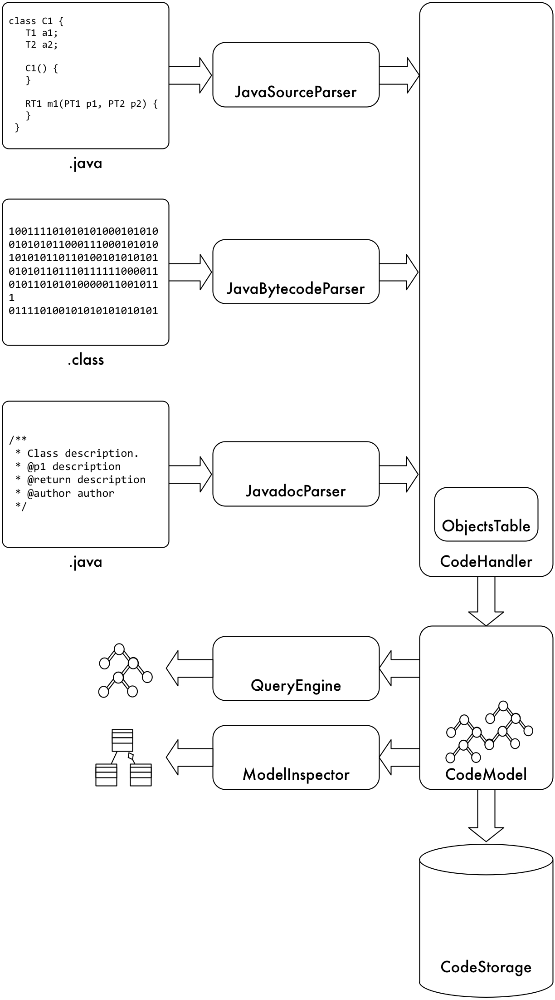

# RDFCoder Architecture

This section describes the RDF Coder overall architecture. The main elements of architecture are:
- *Java Source Parser*: a set of classes able to parse .java files and convert its contents in CodeHandler events.
- *Java Bytecode Parser*: a set of classes able to parse .class files (eventually inside .jar archives) and convert its contents in Code Handler events.
- *Javadoc Parser*: a set of classes able to parse .java files Javadoc documentation and convert it in Code Handler events.
- *Code Handler*: the Code Handler is a class able to convert class events in RDF triples. 
The way the Code handler translates received events into triples is described in model section. Despite the Code Handler currently generates only RDF triples, in theory may generate any entity representation compliant with the interface of the Code Model.
- *Objects Table*: the Code Handler needs to fully qualify (i.e.: add full package qualification) all the objects it finds during the compilation process. 
The fully qualification is done by populating and querying the Objects Table. Every time that an Object needs to be fully qualified, the Objects Table is inquired by providing the object name and the Imports Context that is the list of the imports provided when used the object itself.
- *Code Model*: the Code Model is a container of the triples representing a bunch of related libraries. 
A code model provides operations to add triples, remove triples, perform basic search on triples, perform complex queries. 
Despite currently the only implementation provided is an RDF model, the Code Model may rely on any support able to store relationships among the entities involved in the code representation.
- *Code Storage*: the Code Storage is a set of classes meant to make persistent a code model. 
There may be several persistent storages like Filesystem or a RDMS.
- *Query Engine*: the Query Engine is a set of classes meant to perform queries on a storage. 
At the moment the only supported query language is SPARQL.
- *Model Inspector*: the Model Inspector is a high level representation of the Code Model. 
By using the Model Inspector it is possible to navigate Java objects representing the entities stored into the model.

## Architectural Diagram

## Code Organization

### Parsing
[*Objects Table*](../javadoc/com/asemantics/rdfcoder/sourceparse/ObjectsTable.html)
This class defines a table to resolve objects.

[*Java Source File Parser*](../javadoc/com/asemantics/rdfcoder/sourceparse/JavaSourceFileParser.html)
This class is able to scan a java source file and generate corresponding triples.

[*Javadoc File Parser*](../javadoc/com/asemantics/rdfcoder/sourceparse/JavadocFileParser.html)
The Javadoc file parser.

[*Java Bytecode File Parser*](../javadoc/com/asemantics/rdfcoder/sourceparse/JavaBytecodeFileParser.html)
The Java bytecode parser.

[*Java Bytecode Jar Parser*](../javadoc/com/asemantics/rdfcoder/sourceparse/JavaBytecodeJarParser.html)
This class provides methods to process the content of a Jar file.

[*Directory Parser*](../javadoc/com/asemantics/rdfcoder/sourceparse/DirectoryParser.html)
Scans a given directory.

### Modeling

[*Code Handler*](../javadoc/com/asemantics/rdfcoder/model/CodeHandler.html)
This interface represents a code handler. An handler is something able to receive code analysis events and use it to perform some analysis.

[*Code Model*](../javadoc/com/asemantics/rdfcoder/model/CodeModel.html)
This abstract class describes a code org.asemantics.model. A code org.asemantics.model is a rapresentation of a code structure containing packages, classes, attributes methods and so on.

[*Query Model*](../javadoc/com/asemantics/rdfcoder/model/QueryModel.html)
Common interface to perform queries on representational model.

### Storing
[*Code Storage*](../javadoc/com/asemantics/rdfcoder/storage/CodeStorage.html)
Defines a persistent sotrage for a CodeModel.
