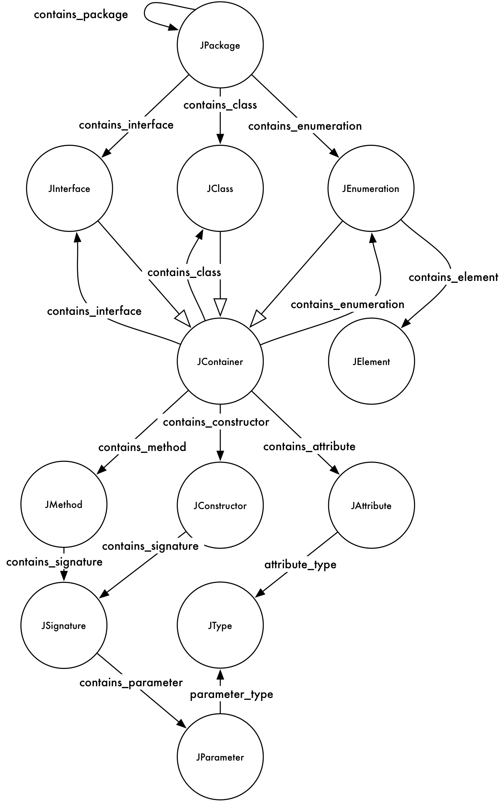

# The Kabbalah Model

The _Kabbalah Model_ is the [ontology] (https://www.w3.org/standards/semanticweb/ontology) behind RDFCoder.
This model represents the _RDF_ Schema used by RDFCoder to represent the code analysis information. 
The name _Kabbalah_ model was chosen for the similarity to the [Kabbalah](https://en.wikipedia.org/wiki/Kabbalah).



## Resource Identifiers
The _Kabbalah model_ defines resources and relationships among resources. Every resource within the model is represented by a resource identifier. Almost every resource stored within a model is an Identifier.

The identifiers have a fixed structure that can be represented with the following BNF rules:

```
<IDENTIFIER> ::= (<PREFIX> '#')? <SECTIONS>;
<SECTIONS>   ::= <SECTIONS> '.' <SECTION> | <SECTION>;
<SECTION> ::= (qualifier ':')? fragment
```								

Every identifier can have a prefix that, if present, must end with _'#'_, The identifier is composed of a sequence of sections separated by '.', every section can contain a qualifier and must define a fragment. The characters _'#' '.' ':'_ are used to identify the different parts of the identifier, fir this reason they cannot be used neither in the prefix nor in qualifiers or fragments.
An example of valid identifiers are:

```
http://www.rdfcoder.org/2007/1.0#jpackage:com.asemantics.rdfcoder.jclass:CoderUtils
http://www.rdfcoder.org/2007/1.0#jpackage:com.asemantics.rdfcoder.model.jinterface:CodeHandler
```
							
Within the RDFCoder API, identifiers are represented by the class _com.asemantics.rdfcoder.model.Identifier_. The identifiers can be build using the class com.asemantics.rdfcoder.model.IdentifierBuilder and read using _com.asemantics.rdfcoder.model.IdentifierReader_.
